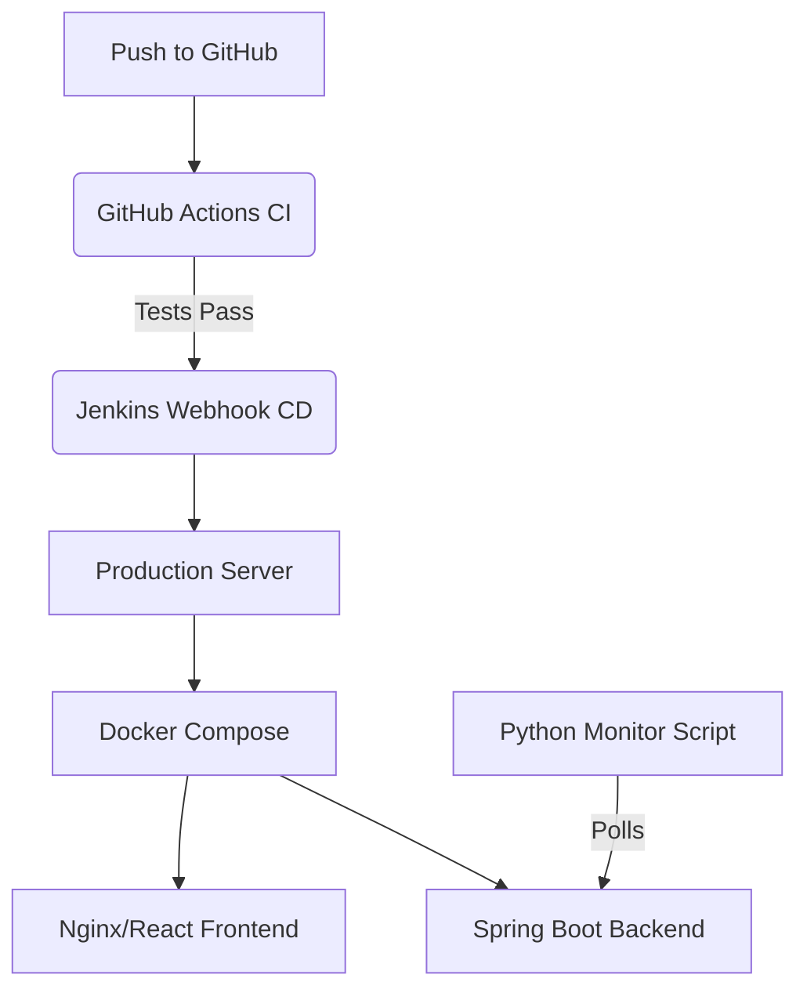

# Real-Time Event Ticketing Platform

[](https://github.com/Jehanfernando02/Real-Time-Event-Ticketing-System/actions/workflows/ci.yml)
[](https://docker.com)
[](https://jenkins.io)

A full-stack, real-time event ticketing system built with React and Spring Boot. 

> **Live Deployments:**
> - **Frontend (Vercel):** [Live URL]
> - **Backend (Render):** [Live URL]

---

## 🚀 DevOps Architecture 

While the application is currently live on managed PaaS providers (Vercel & Render), this repository is fully equipped with an **Enterprise DevOps Architecture** designed for production server deployment. This demonstrates the ability to not just build applications, but to engineer their deployment pipelines from scratch.

### Architecture Diagram


### DevOps Features Implemented

| Skill | Implementation Details |
|---|---|
| **Containerization (Docker)** | Both the Frontend and Backend have custom `Dockerfile`s. A root `docker-compose.yml` orchestrates them on a custom bridge network. |
| **Continuous Integration (GitHub Actions)** | `.github/workflows/ci.yml` automatically validates the Maven backend build, the npm frontend build, and Docker compilation on every push. |
| **Continuous Deployment (Jenkins)** | A declarative `Jenkinsfile` written in **Groovy** manages the automated deployment of the Docker containers to a server. |
| **System Monitoring (Python)** | `scripts/health_monitor.py` polls the Spring Boot `/actuator/health` endpoint every 30 seconds to monitor response times and uptime. |

### How to Run Locally using Docker

You do not need Node.js or Java installed on your machine. Simply use Docker:

```bash
# 1. Clone the repository
git clone https://github.com/Jehanfernando02/Real-Time-Event-Ticketing-System.git
cd Real-Time-Event-Ticketing-System

# 2. Build and start the containers
docker compose up -d --build

# 3. Monitor the backend health
python3 scripts/health_monitor.py
```

- **Frontend** will be available at `http://localhost:80`
- **Backend API** will be available at `http://localhost:8080`

---

## 📖 Introduction (Original Documentation)
The Real-Time Event Ticketing Platform Frontend is a user-friendly web application built with React. It allows users to configure ticketing parameters, start and stop the ticketing system, and view real-time updates on ticket availability and system logs. This frontend interacts with a Spring Boot backend to manage ticket sales dynamically.

## ⚙️ Setup Instructions
### Prerequisites
Before you begin, ensure you have the following installed on your machine (if you are NOT using Docker):
- Node.js: Version 14 or higher (recommended).
- Java 17 for the backend.

### How to Build and Run the Application
1. **Clone the Repository:** 
   `git clone https://github.com/Jehanfernando02/Real-Time-Event-Ticketing-System`
2. **Install Dependencies:** 
   Run `npm install` inside the `Frontend/` folder.
3. **Run the Application:** 
   Start the React application with `npm start`.
4. **Access the Application:** 
   The frontend will be accessible at `http://localhost:3000`. Ensure that your backend is running on `http://localhost:8080` for API calls to function correctly.

## 🛠️ Usage Instructions

### Configuring and Starting the System
Navigate to the Configuration Form in the application. Enter the following parameters:
- **Total Number of Tickets:** Specify how many tickets are available for sale.
- **Ticket Release Rate:** Define how many tickets vendors can release per second.
- **Customer Retrieval Rate:** Set how quickly customers can retrieve tickets.
- **Maximum Ticket Capacity:** Indicate the maximum number of tickets that can be held in the system.

Once you have entered these values, click on "Set Configuration" to save them.

### Managing the System:
Use the Control Panel to manage system operations:
- **Start System:** Begin processing tickets based on your configuration.
- **Stop System:** Halt all operations.
- **Reset System:** Clear all current operations and logs.

### Explanation of UI Controls
- **Configuration Form:** Input fields for setting up ticket parameters with validation feedback for errors.
- **Control Panel:** Buttons that allow users to control system operations (start, stop, reset).
- **Ticket Display:** Displays real-time updates on available tickets.
- **Log Display:** Shows logs of system activities for monitoring purposes.

## 🎉 Conclusion
The Real-Time Event Ticketing Platform Frontend is designed to provide an intuitive interface for managing ticket sales in real-time. By following these instructions, you can easily set up and run the frontend application alongside your backend service.
